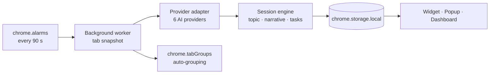

<div align="center">

# TabMind

**A local-first AI session tracker for Chrome.**

TabMind watches your open tabs, works out what you're actually doing, and turns
it into sessions, tasks, and notes — all stored on your machine.

[](https://wxt.dev)
[](https://developer.chrome.com/docs/extensions/develop/migrate/what-is-mv3)
[](https://www.typescriptlang.org)
[](https://react.dev)
[](#testing)

</div>

---

## The problem

Forty open tabs and no memory of why. Browser history tells you where you have
been — not what you were doing. TabMind closes that gap: every 90 seconds it
snapshots your open tabs and asks an LLM one question, *"what is this person
working on?"* — then surfaces the answer, and the tasks hiding inside those
tabs, right on the page.

## What it does

- **Session awareness** — detects your current focus ("Debugging a React hydration issue"), not just a list of URLs
- **Floating widget** — a draggable, minimizable glass panel injected on any page: topic, narrative, tasks, notes, and goals
- **Task manager** — AI-extracted or manual tasks with categories, time estimates, Today / Tomorrow / Someday scheduling, and daily rollover
- **Tab grouping** — automatically groups related Chrome tabs by topic via `chrome.tabGroups`
- **Notes** — per-URL notes that survive navigation, plus global quick notes in Work / Personal / Ideas / Learning categories
- **Goals** — type a goal, get five concrete sub-tasks back from the AI
- **Dashboard** — full-page session history, week calendar, note folders, and goal progress
- **Keyboard shortcut** — `Ctrl+Shift+K` / `Cmd+Shift+K` toggles the widget

## Architecture



The background worker guards against overlapping snapshots when an AI call runs
long, and a 429 rate limit triggers a scheduled retry with a plain-English
explanation instead of a silent failure.

### Providers

Paste one API key — the provider is detected automatically from the key prefix:

**OpenRouter** · **Cerebras** · **Groq / xAI Grok** (one adapter, endpoint
chosen by key prefix) · **Anthropic Claude** · **Google Gemini** · **OpenAI**

### Privacy model

- All state lives in `chrome.storage.local` — no servers, no accounts
- The only network traffic is the tab context sent to the AI provider **you** configure
- **Domain blocklist** — blocklisted sites never contribute page text to AI calls
- Error monitoring (Sentry) ships **disabled**: the DSN is empty by default, so errors stay in your console

## Testing

**33 Vitest cases** cover the session engine, storage layer, task logic, AI
response parsing, and background orchestration — plus two live integration
suites that exercise real provider endpoints.

```bash
npm test        # runs the extension workspace's Vitest suite
```

## Quick start

**Prerequisites:** Node.js 18+ and a free API key from any supported provider.

```bash
git clone https://github.com/thribhuvan003/tabmind.git
cd tabmind
npm install
npm run build:ext
```

1. Open `chrome://extensions` and enable **Developer mode**
2. Click **Load unpacked** and select `extension/.output/chrome-mv3`
3. Click the TabMind icon → **Open settings** → paste your API key
4. Hit **Save & analyze now** — the widget appears within seconds

## Repository structure

```
tabmind/
├── extension/                 WXT + React 18 Chrome extension (Manifest V3)
│   ├── entrypoints/
│   │   ├── background/        Alarm-driven snapshot loop, AI calls, tab grouping
│   │   ├── content/           Floating glass widget injected on every page
│   │   ├── popup/             Toolbar popup
│   │   ├── dashboard/         Full-page history, calendar, notes, goals
│   │   └── options/           Settings and API key management
│   ├── lib/
│   │   ├── ai/                6 provider adapters + key-prefix auto-detection
│   │   ├── session-engine.ts  Session inference and narrative building
│   │   ├── storage.ts         chrome.storage persistence layer
│   │   ├── tab-groups.ts      chrome.tabGroups topic grouping
│   │   └── tasks.ts           Task extraction, scheduling, daily rollover
│   ├── stores/                Zustand widget state
│   └── __tests__/             33 Vitest cases + live integration suites
└── web/                       Next.js landing page
```

## Tech stack

WXT 0.19 · TypeScript · React 18 · Zustand · Tailwind CSS · Vitest · Chrome Manifest V3

---

<div align="center">

Built by [Thribhuvan](https://github.com/thribhuvan003)

</div>
